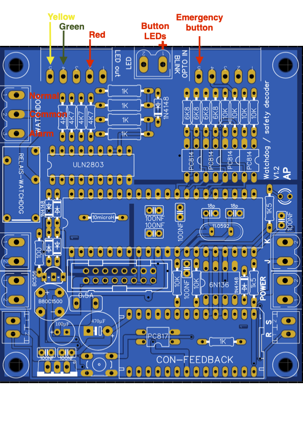

# Addresses and Configuration #

### DCC and RS-Bus addresses ###
The DCC address can be set using the onboard button, like all other decoder boards. Once an Accessory address is entered, it will be stored in the respective CVs. However, via the onboard button we can not set the RS-bus address. By default that address is 127. In case a change is needed, POM messages should be used to change the CV for the RS-Bus address (CV10)

### Watchdog commands: ###
- Accessory Address: 1005
- DCC connected to LZV "RIJDEN"
- Switch commands should alternate between + and -
- Time-out is 5 seconds

### RS-Bus: ###
- Address: 127
- Connected to LZV "RIJDEN"
- Emergency bit: 8
- Configured as Push button

### Connection ###
The Watchdog relay connects / disconnects the C Signal between LZV 100 and the boosters. Note that the E signal is NOT used to signal an overload or short-circuit to the LZV 100, since the LZV reacts upon such situation by switching off all connected devices via Xpressnet. As a consequence, all feedback decoders will loose power.

