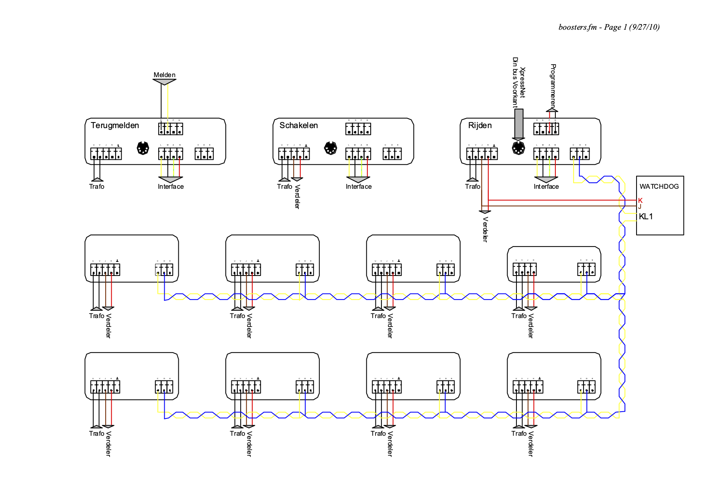
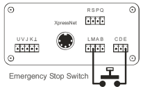

# Alternatives to stop trains #

This page describe possibilities to implement emergency stops.

## 1) Interrupt the signal between command station and boosters ##
A first possibility is to interrupt the signal that flows between master station and boosters. In the figure below the yellow wire (difficult to see...) from LZV100 to boosters can be interrupted by the safety decoder's relay. This figure shows how the current board is connected.

Boosters that do not receive a valid DCC signal will remove power from the tracks. The disadvantage of this approach is that GBM decoders, which are also powered from the tracks, loose their status as well.

## 2) Connect the E and M terminals of the command station ##
A second possibility is described in the Lenz LZV100 manual and shown in the picture below (copyright picture is Lenz). A push button may connect the E terminal to M (Masse). If the button is pushed, power will be removed from the tracks. In principle this should provide the same functionality as described above.

The Lenz manual also describes that E between boosters and LZV100 may be connected permanently. The disadvantage of that is that a short-circuit at one booster will remove power from all other boosters, and this also all GBM decoders. This is undesirable in my specific case, where some decoders are powered from track.

## 3) XpressNet: Stop operations request ##
A third possibility is to let the decoder generate an Xpressnet *Stop operations request* (`Binary: 0010 0001`). This instruction tells the command station to immediately stop sending DCC packets to the track and to switch off the DCC track power. After turning off the track power, the command station sends Track power Off as a broadcast message several times to all XpressNet devices. The Traincontroller software, as well as all handhelds, will be informed of the emergency stop.

Like the previous alternatives the disadvantage of this approach is that GBM decoders will loose power.

## 4) XpressNet: Stop all locomotives request ##
A fourth possibility is to let the decoder generate an Xpressnet *Stop all locomotives request* (`Binary: 1000 0000`). This instruction tells the command station to send DCC-RESET messages, which immediately stop all locomotives. The command station sends everything stopped to all XpressNet devices. The Traincontroller software, as well as all handhelds, will be informed of the emergency stop.

The advantage of this approach is that the DCC track power remains switched on, so that GBM decoders keep working. ALl lights (and other functions)
 will be switched off, however.
 
The current AtMega 16 based safety decoder board is unable to generate XpressNet messages. However, the lift decoder board does include all hardware to generate XpressNet messages, and a RS-485 library for this board was already implemented.

# AtMega 16 based safety decoder board #
The AtMega 16 based safety decoder board can operate in two different states: **Local** and **Remote**

In the **Local** state it uses the first approach above to stop trains.

In the **Remote** state it sends a RS-Bus message to Traincontroller, which should subsequently uses the fourth approach to stop trains (`Einfrieren`). Also handhelds use this approach (although this may be reconfigured to the third approach).
